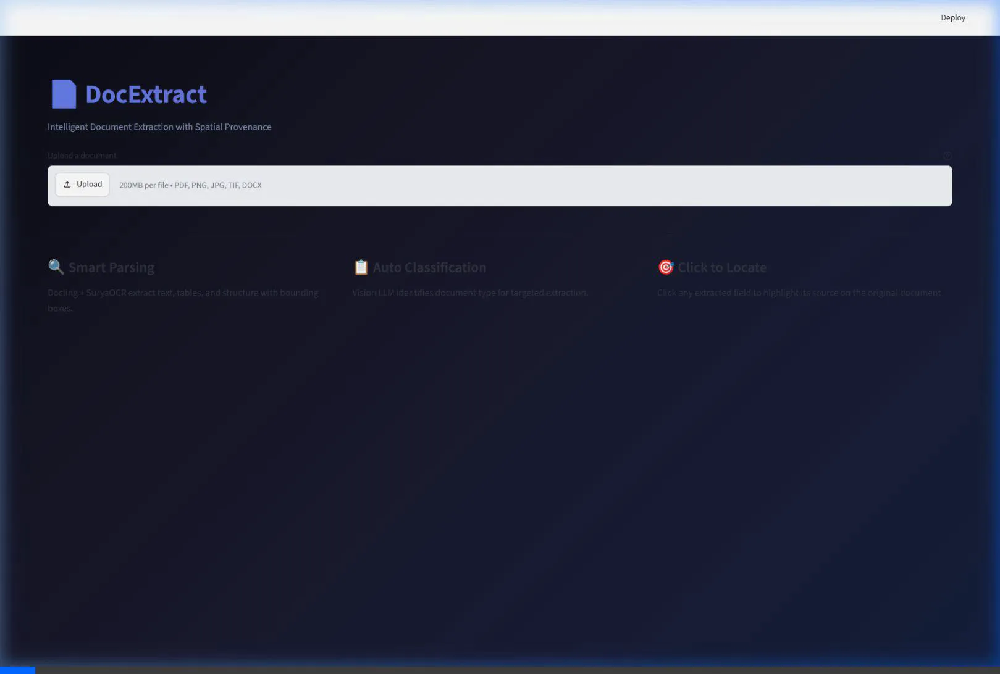
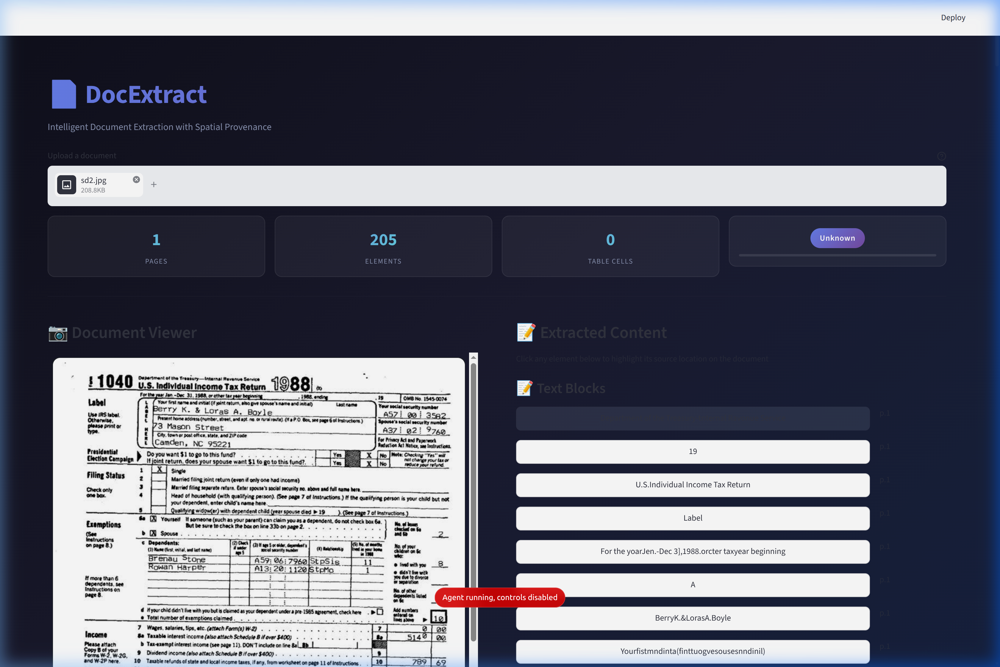
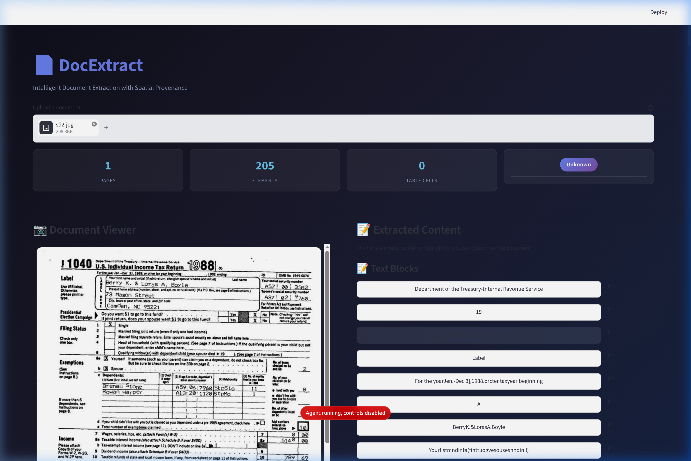

# DocExtract — Intelligent Document Extraction with Spatial Provenance

A complete on-premise **Document Extraction System** that ingests files, structures them into clean Markdown format with bounding box coordinates, and lets users interactively locate extracted text directly on the source document image.

---

## Key Features

- **Ingestion**: Supports PDFs, Images (JPG, PNG, TIFF), and Word documents (`.docx`).
- **Auto Classification**: Automatically identifies the document type (e.g. Tax Form, Invoice, ID) using a Vision LLM.
- **Smart Parsing**: Leverages **Docling** and **SuryaOCR** for premium structural parsing and layout detection.
- **VLM Extraction**: Structured key-value extraction with fallback logic.
- **Interactive Highlight**: An elegant, split-pane Streamlit interface showing the document page side-by-side with extracted content; clicking any extracted line highlights its origin on the document view canvas.

---

## System Architecture

```mermaid
graph LR
    A["📤 Upload"] --> B["FastAPI Backend"]
    B --> C["LangGraph Pipeline"]
    C --> D["Ingest Node"]
    D --> E["Classify Node"]
    E --> F["Parse Node"]
    F --> G["Extract Node"]
    G --> H["Format Node"]
    H --> I["SSE Stream"]
    I --> J["Streamlit Frontend"]
    J --> K["Split-Pane Viewer"]
```



### LangGraph Pipeline Stages
- **Ingest Node**: Decodes uploads, converts PDF/DOCX pages to high-res images.
- **Classify Node**: Queries VLM to identify document classification.
- **Parse Node**: Executes Docling extraction and bounding box coordinate calculation.
- **Extract Node**: Prompts VLM for structured key details.
- **Format Node**: Outputs final Markdown-formatted tables/text list with exact page geometry.

---

## User Interface Showcase

### Landing Page


### Interactive Results View


### Click-to-Highlight Feature


---

## Getting Started

### Local Setup (using `uv`)

1. **Clone and navigate to the directory**:
   ```bash
   cd DocExtract
   ```

2. **Run Backend (FastAPI on Port 8100)**:
   ```bash
   PYTHONPATH="./backend" uv run uvicorn app.main:app --port 8100
   ```

3. **Run Frontend (Streamlit on Port 8501)**:
   ```bash
   PYTHONPATH="./backend" BACKEND_URL="http://localhost:8100" uv run streamlit run frontend/app.py --server.port 8501
   ```

4. Open [http://localhost:8501](http://localhost:8501) in your browser.

### Docker Setup

To build and run all services (Backend, Frontend, and Local LLM service) via Docker:

```bash
docker compose up --build
```
